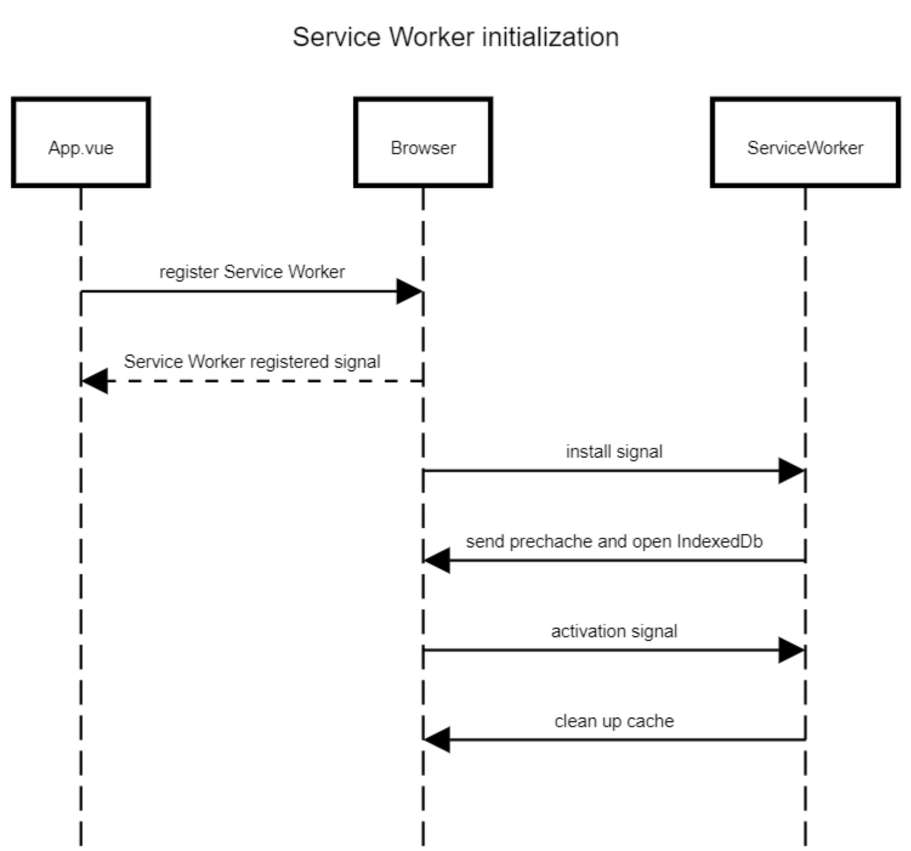
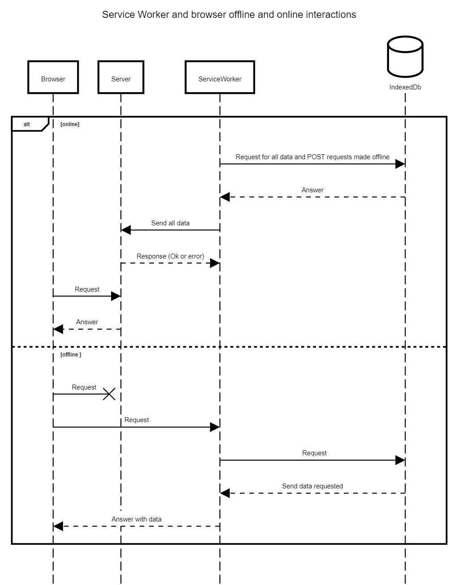

# Service Worker

## Service Worker
A service worker is a javascript file that is registered in the browser. It intercepts network requests and fetch/caching requests. It runs in a separate thread from the browser thread which means that some properties are not available. for example, it can't access the Document Object Model directly and has to use methods to communicate with the page.

Service workers need a valid SSL certificate to be registered as it can intercept network requests, it is susceptible to "man-in-the-middle" attacks.

The service worker goes through three phases before operating: registeration, intallation and activation   


## Initialization
The service worker is declared and registered inside App.vue.
```
if ('serviceWorker' in navigator) {
  window.addEventListener('load', function() {
    navigator.serviceWorker.register('./service-worker.js',{type:'module',}).then(function() {
    })
  })
}
```

The browser then decides wether the service worker is new or an update to a current registered service worker. In this phase, the service worker sends all the files that we wish to precache and oens the IndexedDb.

```
self.addEventListener('install', (event) => {
  precacheGetRequest(event);
  createIndexedDB();
});
```

The final phase is activation. In this phase, the service worker is operating. When the activation event is flaired up, the listener in the service worker is actiavted and a request is sent to the browser to delete all previous versions of the cache.     
```
self.addEventListener('activate', (event) => {
	event.waitUntil(
		self.clients.claim(),
		caches.keys().then((cacheNames) => {
			return Promise.all(
				cacheNames.map((cache) => {
					if (cache !== CACHE.name + CACHE.version) {
						return caches.delete(cache);
					}
				})
			);
		})
	);
})
```


A manifest.json is also required to register the service worker. 

## App installation
Service workers, alongside a manifest.json file enable the transformation of a website into an installable app.

To install Baku, click on the arrow on the far right side of the adress bar in the browser.  

To uninstall the app, click on the three horizontal bars inside the app window and click on "uninstall Baku".


## Caching files
### Precaching
Critical files and assets can be cached by the service worker on installation. This is done in the `precacheGetRequest` function where you can add more files. What this means is that a user only needs internet access once in order to navigate the website. 
### Caching files
 Pictures and sounds are added to the IndexedDb in the `createSoundFile` and `createImgFile` functions  


### IndexedDB
An Indexed Data Base is initialized on install. This database is used to store events, requests and sounds while the navigator is offline. 

Sounds are stored as files, so no need to change them back into files when accessing them. 

### Navigation 
Navigating the website isn't changed by being offline. We had to answer the requests so as to not get any errors when using fonctionnalities. To do so, the path for the request is parsed inside the `fetchevent` listener and different answers are provided by the `createAndSendResponse` function.   


### Accessing files
Request for sound and image files are handled differently. 
Image files are found both in cache and in the IndexedDB  as raw data and are transformed back to Blobs to be viewable.
Sound files are stored as is in the IndexedDB, as such they can be sent to the browser without nedding to transform them back to files.
The history, status and stack requests are also added to the cache   

## Sending requests back to server  
Once the navigator is online again, App.vue goes through all the entries in the IndexedDb and sends them to the server. That is done in the sendOfflinePostrequests.


## Connection Indicator
A connection indicator was added to inform the user of the current state of files:
* green: navigator is online and all files are synced with the server
* orange: navigator is online and files are being sent to the server
* red: navigator is offline

The component is described in ConnectionLight.vue. It relies on 3 events: online,offline and synced. The synced event is dispatched to the window in App.vue when all the post requests are answered.   


